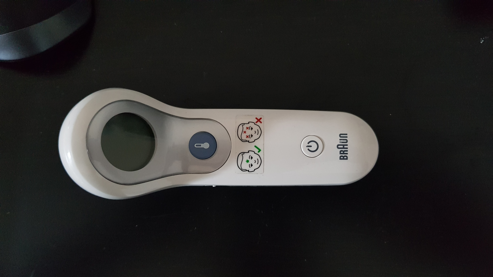
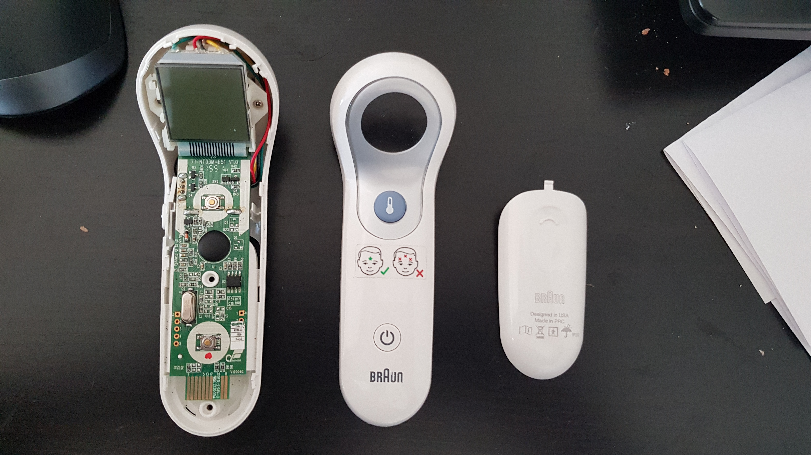
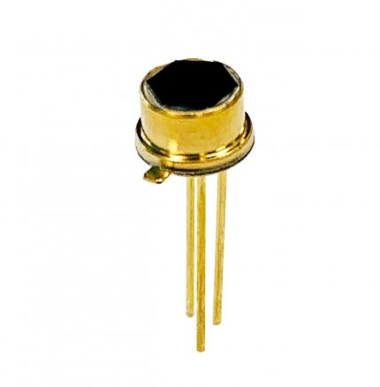
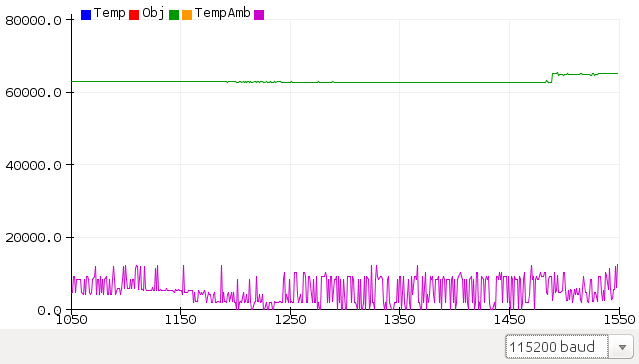
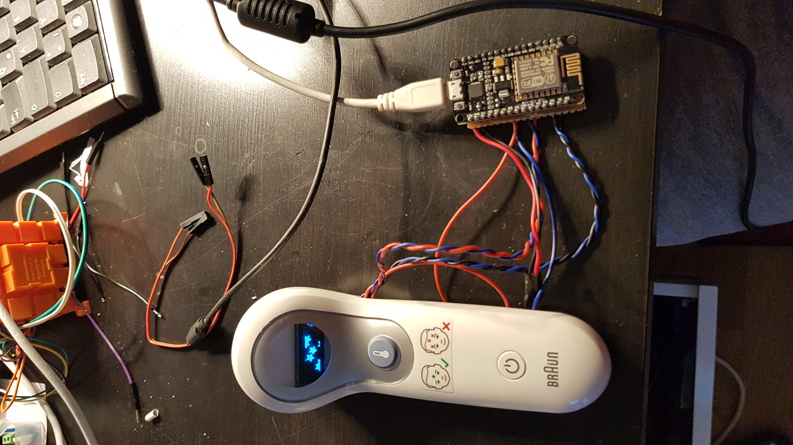

# Hacking a Contact less thermometer
I have a ["Braun No touch + touch forehead thermometer"](https://www.braunhealthcare.com/za_en/thermometers/forehead/braun-no-touch-forehead), which stopped working after some time. It was lying around dead for a while until Covid-19 came around.
<table>
  <tr>
    <td>
      
    </td>
  </tr>
</table>
This defective thermometer would not power on at all. I tried to fix it but it seemed like that it has lived its life. After disassembly, I found it to consist of the following components: 
- LCD for display
- RGB LCD back lit
- IR distance sensor
- Thermopile temperature sensor, [TPiS 1T 1252B](https://www.excelitas.com/product/tpis-1t-1252b-digipile-sensor) 
- Thermocouple temperature sensor
- CPU board with button and a buzzer

<table>
  <tr>
    <td>
      
    </td>
  </tr>
</table>

## Necessity is the mother of invention
One of the symptoms for the Covid-19 is the increased body temperature, leading to [high fever](https://www.who.int/health-topics/coronavirus#tab=tab_3). So, I needed an accurate contact-less thermometer. 
It all started with reverse engineering the whole sensing module. It consisted of the following components:
- IR distance sensor to measure the distance to the object in front
- LED light to point at the object
- Thermopile temperature sensor to measure temperature of the object
- Thermocouple temperature to measure ambient temperature 

The most difficult part was to guess, which IR temperature sensor is it. There was not part number written over it, just four connections labeled as VCC, DIRECT, GND and HEARTER. The heater and Gnd were connected. A bit of letting Google know what I was looking for led to me a catalog of IR sensors.  I found one sensor, which looked similar and had communication interface with the name of "DIRECT". It outputs 17 bits of the object temperature along with 14 bits of ambient temperature. 
<table>
  <tr>
    <td>
      
    </td>
  </tr>
</table>

## The Adventure of the single wire IO protocol
TBA

## Connection to the ESP
TBA

## Raw values, Object and Ambient temperature
<table>
  <tr>
    <td>
      
    </td>
  </tr>
</table>

## LCD replacement with OLED SSD1306 Display

<table>
  <tr>
    <td>
      
    </td>
  </tr>
</table>

## Links and References and Acknowledgments
- Ejaad-Nama, a is newsletter. which cover different technology news. Please, subscribe [here](https://ejaadnama.substack.com/)
- [TPiS 1T 1252B DigiPile Sensor](https://www.excelitas.com/product/tpis-1t-1252b-digipile-sensor) 